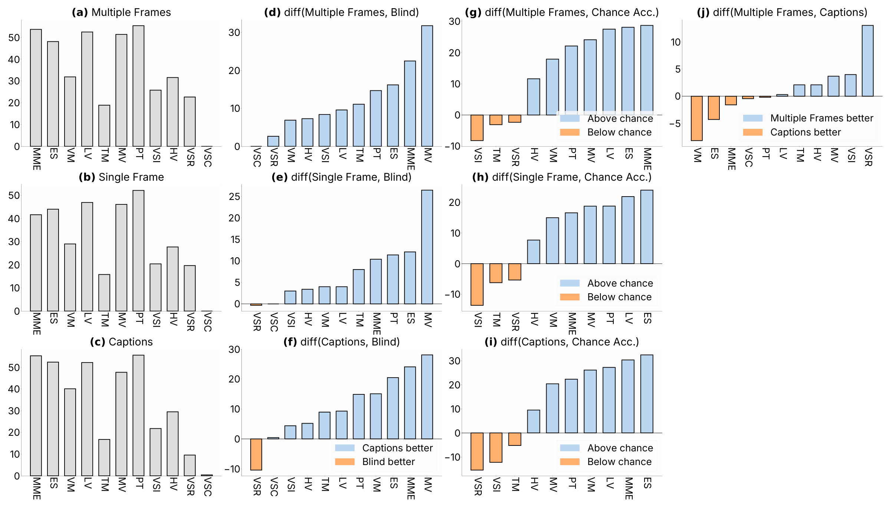
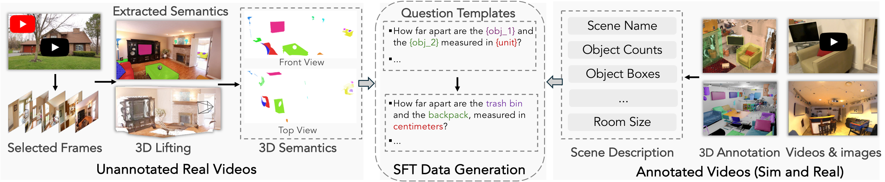

# Cambrian-S — style analysis

Source: arXiv 2511.04670, figure PDFs from the LaTeX source.

## Fig. 2

**What it is.** A 3 × 4 grid of small bar charts diagnosing benchmarks under
three input conditions. Column 1: raw accuracy per benchmark (gray bars);
columns 2–4: **signed differences** versus blind / chance / captions, sorted
ascending, positive bars light blue, negative bars orange. Full width, tall.

**Style.**
- Palette: neutral gray `#dddedd` for raw values; light blue `#bbd7f1` for
  "better", light orange `#feaf6d` for "worse"; all bars with thin black
  edges. Only two hues, both pastel — the sign is the message.
- Bold panel letters `(a)`–`(j)` followed by a plain title that names the
  comparison (`diff(Multiple Frames, Blind)`); the title *is* the formula.
- Bars sorted by value within each diff panel; x tick labels rotated 90° and
  abbreviated (a legend of abbreviations sits inside the figure).
- A per-panel legend only where the sign meaning changes; frame-less.
- Sans-serif (Inter/Helvetica-like), no grid, only left and bottom spines.

**Use when.** Many conditions × many items, where the reader must see *which
items* differ and in which direction — e.g. per-participant or per-task deltas
between conditions. The sorted, signed, two-hue diff bar is one of the most
reusable patterns here.

**Reproduce.** `st.use_palette("cambrian_s")`; `colors = np.where(d >= 0,
st.PALETTES["cambrian_s"][1], st.PALETTES["cambrian_s"][2])`; `ax.bar(x,
sorted_d, color=colors, edgecolor="k", linewidth=0.5)`; `ax.axhline(0,
color="k", lw=0.6)`; panel titles via `ax.set_title(r"$\bf{(d)}$ diff(A, B)",
loc="left")`.

## Fig. 7

**What it is.** Data-curation pipeline: three regions (unannotated real
videos → SFT data generation ← annotated videos), real thumbnails, dashed
rounded containers, black arrows for data flow and hollow arrows for merging
into the center.

**Style.**
- Real screenshots/thumbnails with light drop-free borders; overlays (3D
  boxes, segmentation) in saturated colors on top of desaturated photos.
- Text: large sans-serif labels under each stage; region names in bold at the
  bottom; template placeholders colored by role inline (`{obj_1}` green,
  `{unit}` red) and the same colors reused in the instantiated example — a
  before/after that teaches the reader the substitution.
- Dashed containers with rounded corners; no fill; minimal color outside the
  images so the photos carry the visual weight.

**Use when.** Any pipeline that starts from real recordings (rosbag → events
→ metrics). Put real frames in, keep boxes dashed and unfilled, color only the
things that change.
