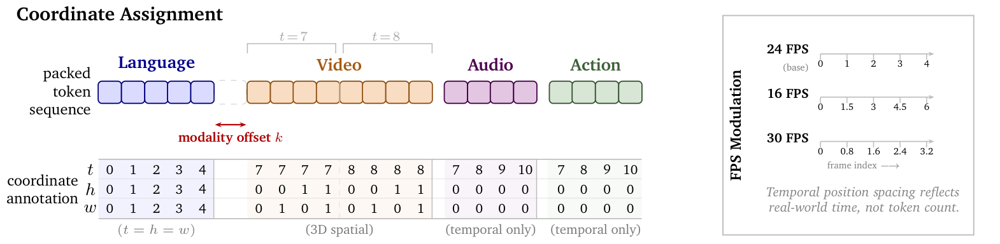
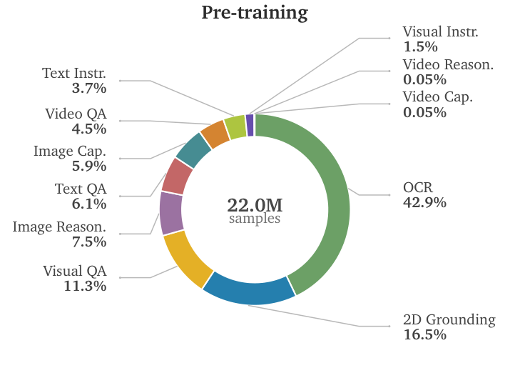
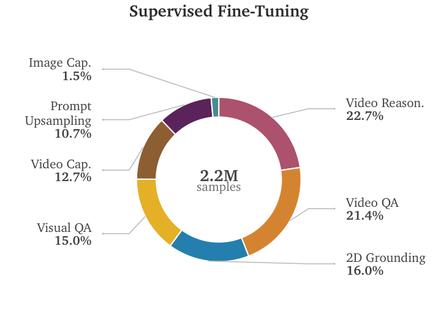

# Cosmos 3 — style analysis

Source: arXiv 2606.02800 (NVIDIA technical report); all figures are TikZ,
rendered from the LaTeX source PDFs. The report uses a serif (Palatino-like)
face in figures to match the body text.

## Fig. 6

**What it is.** Schematic of coordinate assignment over a packed token
sequence: a row of rounded token boxes tinted by modality, a table of
coordinate values beneath, tinted with the same hues at lower alpha, and a
boxed side panel explaining FPS modulation with mini timelines.

**Style.**
- Modality palette (fill / label): language blue `#c9cdf2` / `#1a1a8c`,
  video orange `#f8dcc3` / `#bb694a`, audio purple `#dcc7e3` / `#6e2c6b`,
  action green `#d5e8d5` / `#2e6b3a`. Fills are ~20 % tints of the label color
  so bold colored labels read on white and boxes stay light.
- Annotations in gray (`#8a8a8a`) italics for secondary facts; one red accent
  (`#b00000`) for the single thing the reader must notice (modality offset).
- Rounded rectangles with 0.5 pt darker outlines of the same hue; dashed
  placeholders for elided content; brackets above groups (`t = 7`, `t = 8`).
- Side panel framed with a thin gray box and a rotated bold title.

**Use when.** Explaining a sequence / time-alignment structure (e.g. how
robot, gaze and speech streams are aligned into trials). Tint by stream, keep
bold labels in the saturated version of the same hue.

**Reproduce.** `st.use_palette("cosmos3_modality")` gives the four label
colors; tints via `st.tint(color, 0.2)`. Serif preset: `st.apply_preset("cosmos3")`.

## Fig. 7
 

**What it is.** Two donut charts (pre-training / SFT data mix) with the total
in the center, category labels with bold percentages placed outside and
connected by thin gray leader lines; slices sorted by size clockwise from the
largest.

**Style.**
- Muted categorical palette: green `#6ca066`, blue `#257fae`, yellow
  `#e4b027`, purple `#946ea3`, teal `#498e97`, red `#c36868`, orange `#d48532`;
  white slice separators (~1.5 pt).
- Donut hole ~55 % radius with the total as bold number + small unit.
- Small slices still labeled, pulled out with leader lines instead of being
  lumped into "other"; labels in two lines (name / bold percentage).
- Serif bold title; no legend (labels replace it).

**Use when.** Composition of a dataset / of coding categories / of time spent
per activity. Donut over pie only when the center number matters; for more
than ~8 categories switch to a sorted horizontal bar.
