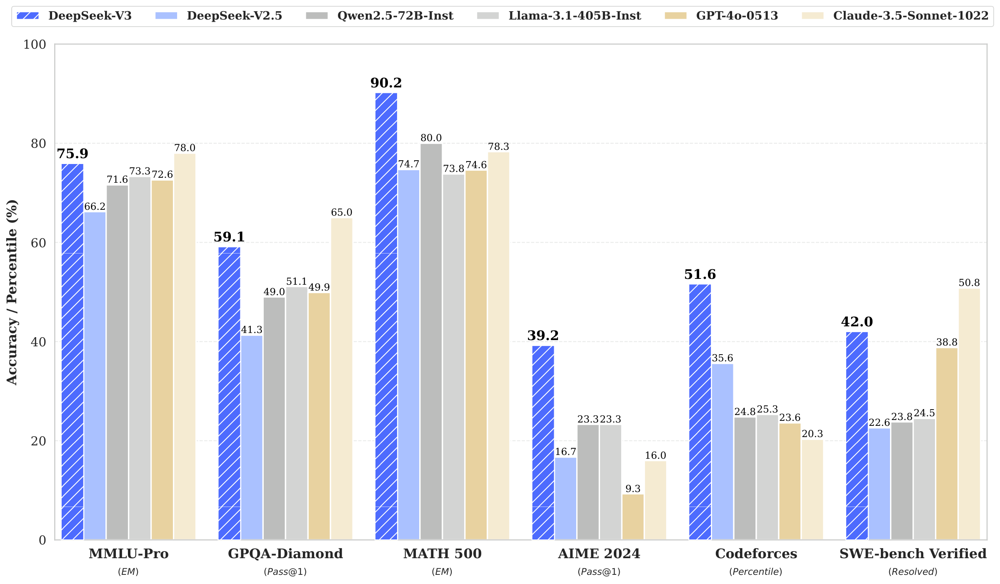
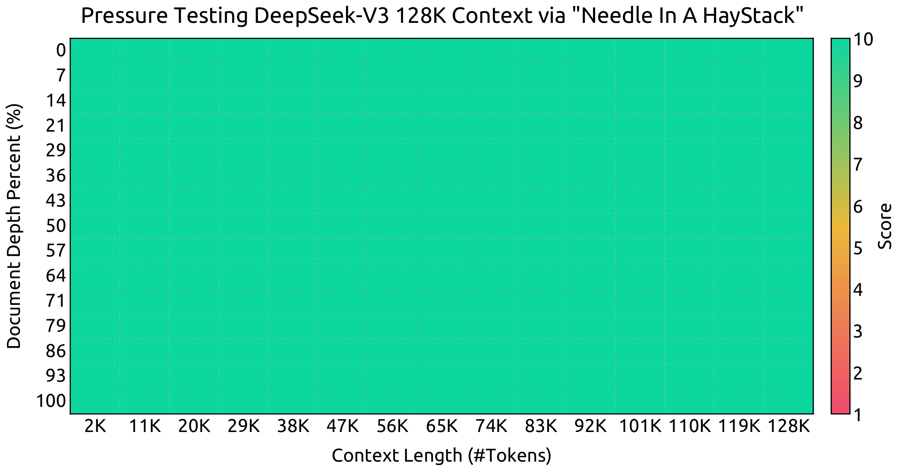
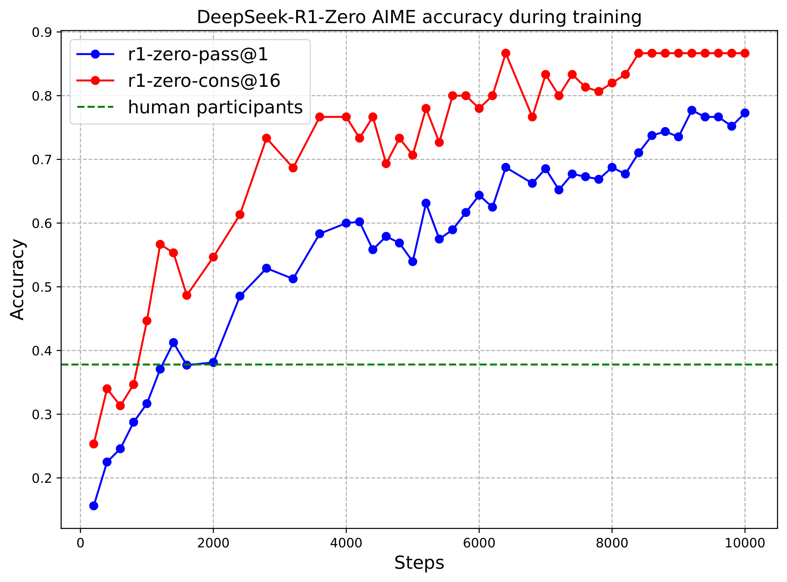
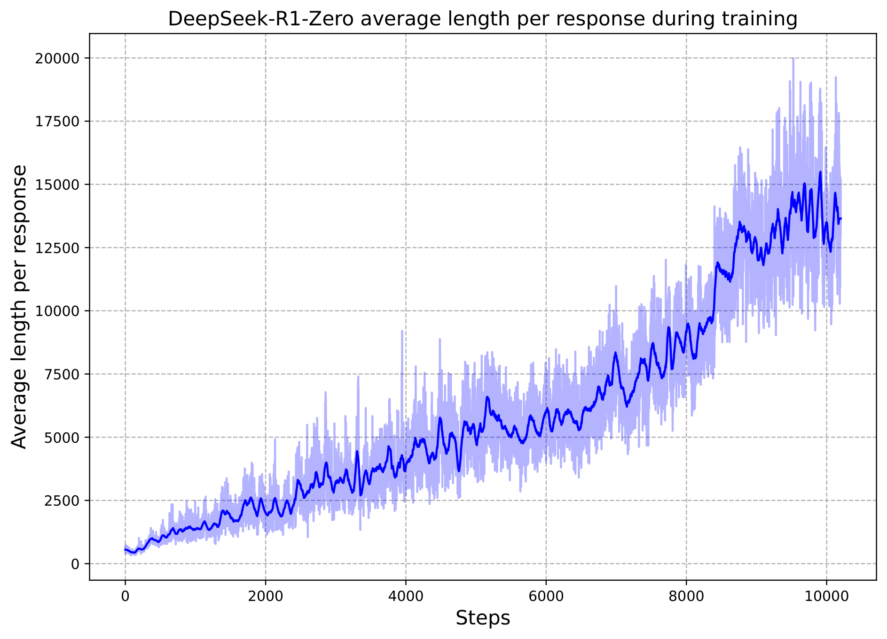
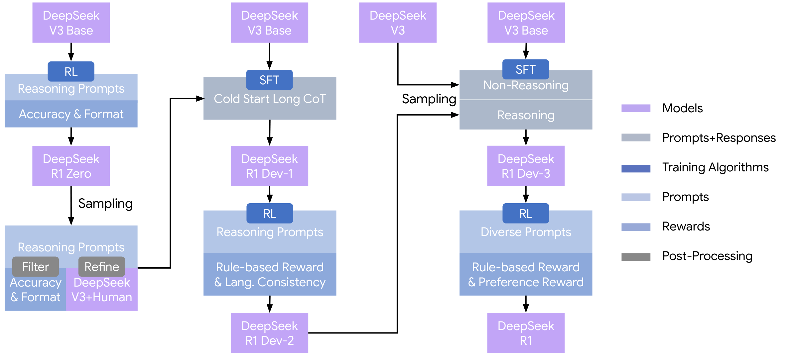

# DeepSeek (V3 technical report, R1) — style analysis

Sources: arXiv 2412.19437 (V3) and 2501.12948 (R1, Nature version), figure
PDFs taken from the LaTeX sources. "DeepSeek style" here means the look of
their headline result figures: royal-blue hero series, competitors in blue
tints and warm neutrals, bold serif labels, value labels on every bar.

## V3 Fig. 1

**What it is.** Grouped bar chart of benchmark scores: x = benchmark (with the
metric in italics underneath), 6 models per group, y = accuracy / percentile.
Full width, ~1.7:1.

**Style.**
- Hero bar: royal blue `#4b69fe` **with white diagonal hatching** and a bold,
  larger value label; other series: light blue `#abc0ff` (own previous model),
  two grays `#b9bab9` / `#d0d0d0` (open baselines), beige `#e8d2a0` and pale
  beige `#f3e6c8` (closed baselines). So the family relation is encoded in hue
  (blue = us, gray = open, beige = closed) and recency in lightness.
- Every bar carries its value; hero values bold. Bars nearly touch inside a
  group (width ≈ 0.9 of slot), thin white edges.
- Horizontal legend in one row above the axes, frame-less; bold serif
  (DejaVu Serif / Times Bold) throughout; dashed light gray horizontal grid
  only; no top/right spine.
- y from 0 to 100 so scores are comparable across benchmarks.

**Use when.** "Ours vs several baselines across several benchmarks / metrics",
and the exact numbers matter. For HRI studies: conditions × metrics summary.

**Reproduce.** `st.use_palette("deepseek")`, `st.apply_preset("deepseek")`
(serif bold, dashed y-grid, hatch on series 0), `ax.bar(..., hatch="//",
edgecolor="white")` for the hero, `ax.bar_label(rects, fmt="%.1f",
fontsize=7, fontweight="bold")`.

## V3 Fig. 8

**What it is.** Needle-in-a-haystack heatmap: x = context length, y = document
depth %, color = score 1–10 with a red→yellow→green colormap and a vertical
colorbar. Full width.

**Style.** Plain sans-serif (DejaVu Sans), big tick labels, dashed faint cell
grid over the heatmap, title as a full sentence. The colormap is a
traffic-light diverging map (`RdYlGn`-like) — readable but not colorblind-safe;
prefer `viridis`/`cividis` or a single-hue sequential unless the "green = good"
semantics is essential.

**Use when.** A 2-D sweep (e.g. distance × speed, trial × participant) where a
single saturated result is the message.

## R1 Fig. 1

**What it is.** (a) Training curves: two metrics with circle markers (pure
blue `#0000ff`, pure red `#ff0000`) and a dashed green human-reference line;
dashed gray grid. (b) Raw per-step values as a light band `#b4b4ff` behind a
dark smoothed line `#0404ff` — the same hue at two lightness levels.

**Style.** Deliberately un-styled matplotlib defaults with primary colors:
readable, honest, slightly dated. The *pattern* worth copying is (b): raw
signal as a light band of the same hue behind its smoothed version, rather
than hiding the noise or using two colors. Keep the reference line dashed and
labeled in the legend.

**Use when.** Learning / time-series curves with a human or chance baseline.

## R1 Fig. 2

**What it is.** Multi-stage pipeline diagram: boxes colored by *role* (models
= lavender `#c2a5f7`, prompts = pale blue `#b3c6e7`, rewards = mid blue
`#8da8db`, training algorithms = royal blue `#4572c4`, prompts+responses =
gray-blue `#aeb8c6`, post-processing = gray `#6c6c6d`), white text inside,
black orthogonal arrows, legend at right.

**Style.** Sans-serif (Google Sans / Product Sans-like), all fills desaturated
so white text stays legible; only the training-algorithm chips are saturated;
consistent box heights per role; no drop shadows or gradients.

**Use when.** Procedure or study-protocol diagrams (sessions → conditions →
measures). Encode *role* by color and keep ≤ 6 roles.
