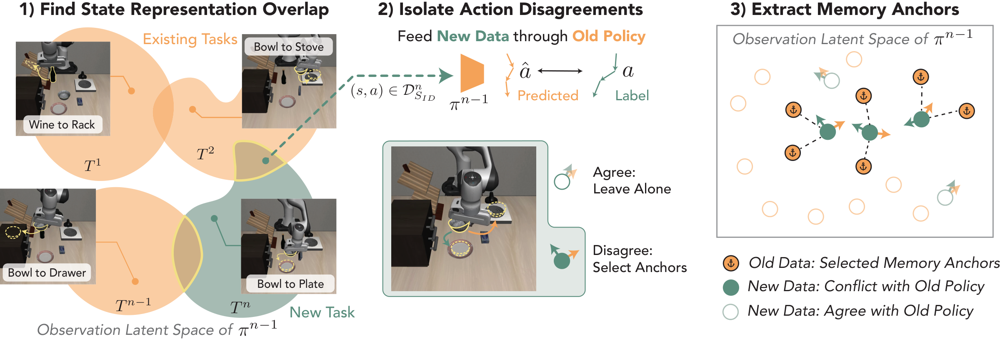
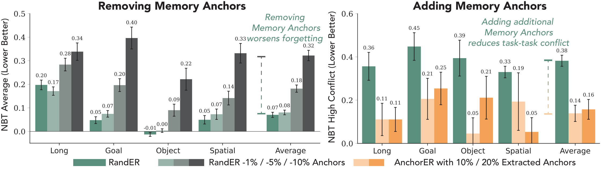
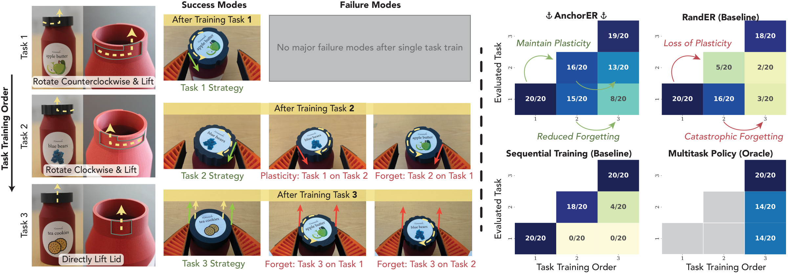

# Memory Anchors for Continual Robot Learning — style analysis

Source: arXiv 2608.26545, figure PDFs from the LaTeX source. Figures use a
geometric sans (Avenir-like) and a consistent two-concept color code across
the whole paper: **old / existing = orange, new = teal-green**.

## Fig. 5

**What it is.** Three-step method diagram: (1) blob diagram of overlapping
latent regions for tasks with robot thumbnails on call-out lines, (2) the
policy as an orange trapezoid with predicted vs labeled actions as arrows in
the two concept colors, (3) a boxed latent space with hollow / filled /
anchor-marked circles and a legend below.

**Style.**
- Two hues only: orange `#f4a258` (fills `#facfa6`) for old tasks and teal
  `#5a8e7d` (fill `#d6e6df`) for the new task; overlap highlighted with a
  yellow outline. Everything else is gray or a photo.
- Numbered bold step titles on top; math (`T^n`, `π^{n-1}`) in the same size
  as text; italic gray caption-like labels for spaces.
- Legend uses the *same glyphs* as the plot (hollow circle, filled circle,
  anchor icon) so the mapping is unambiguous.
- Dashed arrows for "feed through", solid for "is".

**Use when.** Explaining a selection / matching mechanism between two sets
(e.g. old vs new behaviors, human vs robot decisions). Decide the two concept
colors once and reuse them in every results figure.

## Fig. 6

**What it is.** Two grouped bar panels ("Removing …", "Adding …"): x = task
suite (+ Average), bars = method variants, y = forgetting metric (lower is
better), capped black error bars, value labels above each bar, and an italic
teal takeaway sentence with a dashed bracket marking the gap on the Average
group. Shared one-row legend under both panels.

**Style.**
- Baseline teal `#5a8e7d`; ablation strength as a **lightness ramp** of one
  hue: gray ramp `#8db0a5 → #6c7b77 → #545556` for −1/−5/−10 % anchors, orange
  ramp `#fad0a9 → #f4a258` for 10/20 % anchors. New *hues* mark new *concepts*,
  ramps mark *amounts*.
- Bold panel titles that are conclusions ("Removing Memory Anchors"); y-axis
  label includes the direction "(Lower Better)".
- Values printed above bars in small text; error bars black, thin, capped.
- Takeaway sentence inside the axes in the concept color, italic, with a
  dashed vertical bracket pointing at the two bars it compares.
- Legend below the plots with the ramp shown as three adjacent swatches.

**Use when.** Ablations / dose-response comparisons across several
subgroups. This is the closest match for "condition × task metric" HRI
results where a baseline and graded variants are compared.

**Reproduce.** `st.use_palette("memory_anchors")`; ramp via
`st.ramp("#5a8e7d", n=3)` or `st.ramp("#f4a258", 2)`; `ax.bar_label(rects,
fmt="%.2f", fontsize=6, padding=2)`; annotation `ax.text(x, y, "Removing\n…",
color=teal, style="italic", ha="center")`; bracket
`ax.annotate("", xy=(x, y0), xytext=(x, y1), arrowprops=dict(arrowstyle="-",
ls="--", color=teal))`.

## Fig. 7

**What it is.** Left: a photo storyboard (task rows × success/failure
columns) with yellow header bars, dashed motion overlays and green / red
outcome text. Right: four 3 × 3 result matrices (evaluated task × training
order) with a blue sequential colormap, cell text `k/20`, and curved green /
red annotation arrows naming the phenomenon (Maintain plasticity, Catastrophic
forgetting).

**Style.**
- Sequential map for success counts: navy `#222c5d` → blue `#2267a9` → sky
  `#95c4d6` → pale `#e0dcb5` → cream `#fbf9d0` (YlGnBu-like); cells not yet
  trained are neutral gray; white text on dark cells, dark text on light.
- Semantic accent colors used sparingly: green `#4a9a3a` = good, red
  `#c0392b` = bad, yellow `#f6e27a` = header band; the anchor icon tags the
  proposed method's panel title.
- Photos are desaturated slightly so overlays (dashed yellow path, arrows)
  pop; every photo gets a short label chip.
- Lower-triangular matrix layout mirrors the temporal logic (you can only
  evaluate tasks already trained), which makes forgetting visible as fading
  along rows.

**Use when.** Qualitative examples paired with a compact quantitative
summary; any "trained on / evaluated on" or "session × condition" matrix.
