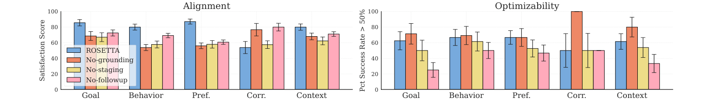
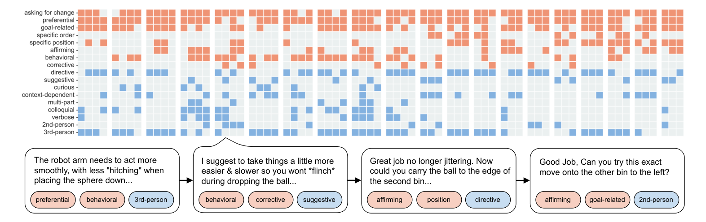

# ROSETTA — style analysis

Source: OpenReview PDF (no LaTeX source available); crops rendered at 220 dpi.

## Fig. 4

**What it is.** Two side-by-side panels (Alignment, Optimizability), each a
grouped bar chart: x = preference category (Goal, Behavior, Pref., Corr.,
Context), one bar per method (ROSETTA + 3 ablations), y = score with capped
error bars. Full text width, ~2.6:1 aspect.

**Style.**
- Palette: 4 pastel fills with thin black edges — blue `#77aadd`, vermillion
  `#ef8866`, yellow `#eddd87`, pink `#fda9ba`. Method of interest is the first,
  bluest bar; ablations are warmer. Black error bars with small caps.
- Serif typeface (Computer Modern / Times), matching the paper body; panel
  titles as plain text above each axes, no bold.
- Very light dotted horizontal grid; spines all four sides but thin.
- Legend inside the first panel, upper-left, framed with a light box;
  legend only once for both panels.
- Bars fill ~85 % of the group width; groups clearly separated.

**Use when.** k categories × m methods with uncertainty, where the reader should
compare methods *within* each category. Works down to single-column width if
you drop to one panel.

**Reproduce.** `st.use_palette("rosetta")`, `ax.bar(..., edgecolor="k",
linewidth=0.6, yerr=..., capsize=2, error_kw={"lw": 0.8})`, `ax.grid(axis="y",
ls=":", lw=0.5, alpha=0.6)`, `ax.set_axisbelow(True)`, legend
`frameon=True, framealpha=0.9, edgecolor="#ccc"`.

## Fig. 5

**What it is.** A binary presence matrix (rows = preference attributes, columns
= preferences grouped in blocks of ~4 per participant), cells colored by
attribute family (content = orange, style = blue) on a light-gray background
grid; below it, four annotated example call-outs with rounded speech bubbles
and colored tag chips.

**Style.**
- Two hues only: orange `#ef9373` (content attributes), blue `#83b1e0` (style
  attributes); absence is a light gray `#ebeff0` cell — never white — so the
  grid structure stays visible. Cell gaps ≈ 15 % of cell size.
- Row labels right-aligned, small sans-serif; column blocks separated by a
  larger gap instead of lines.
- Example bubbles use the same two hues as chips, closing the loop between
  data and qualitative examples. Arrows between bubbles imply sequence.

**Use when.** Many binary or categorical labels over many items (e.g.
questionnaire item coverage, event occurrence per trial, feature presence per
participant). Excellent full-width figure for qualitative coding results.

**Reproduce.** `ax.imshow(mask, cmap=ListedColormap(["#ebeff0", hue]))` per
family or `pcolormesh` with `edgecolors="white", linewidth=1.5`; annotate
with `ax.annotate(..., bbox=dict(boxstyle="round,pad=0.4", fc="white",
ec="k"))`; chips via `bbox=dict(boxstyle="round", fc="#f8cfc1", ec="k")`.
